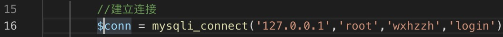
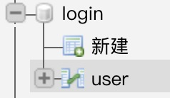
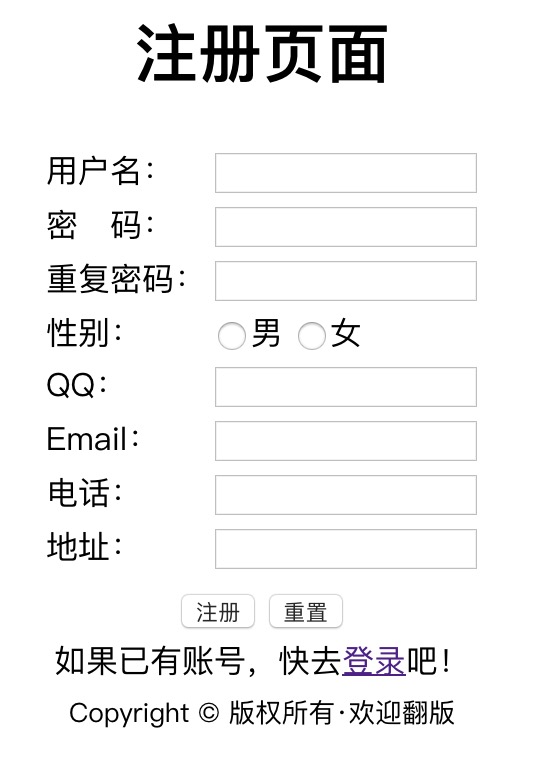
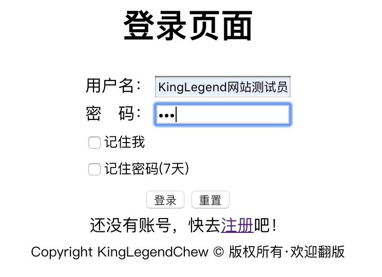

# WebLoginDemo(RefinedCraft工作室)

运用了php，mysql，html5，css3。
我在2018年自制的网站登录注册系统，杂物较多，仅供学习参考。
操作说明：
1，确保Apache服务器正常运行，并已安装PHP和phpmyadmin，下载后移动到目录里。

2，登录phpmyadmin，本代码的默认数据库账户root，密码wxhzzh。

如果不想修改密码请在registeraction.php第16行修改数据库账户和密码并重启Apache服务器。
3，上述步骤执行过后新建一个数据库login，然后新建一个数据表user，

在表user里添加7个字段，分别是：username|password|sex|qq|email|phone|address。

（请严格按要求添加数据表内容，否则无法正常运行）

4，配置完成了✅！
# UI预览：

# 效果预览：

